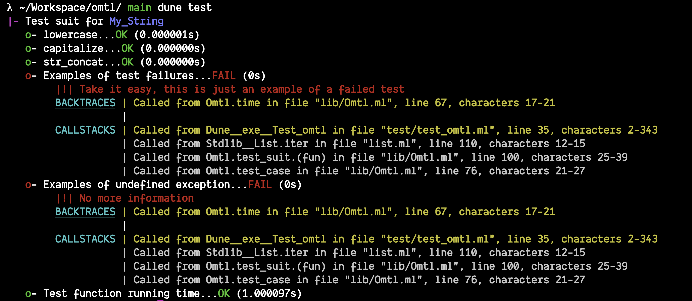

<div align="center">

# Omtl

__OCaml Minimalist Testing Library__



</div>

## Usage
[./test/test_omtl.ml](./test/test_omtl.ml)
```ocaml
open Omtl

(* A module with functions to test *)
module My_String = struct
  let equal = String.equal
  let capitalize = String.capitalize_ascii
  let str_concat = String.concat ""
end

(* The tests *)
let test_equal () =
  if My_String.equal "hello!" "hello!"
  then ()
  else fail "My_String.equal \"hELLO!\" = \"hello!\""
;;

let test_capitalize () =
  if String.equal "HELLO!" (My_String.capitalize "hELLO!")
  then ()
  else fail "My_String.capitalize \"hELLO!\" = \"HELLO!!\""
;;

let test_str_concat () =
  if String.equal "foobar" (My_String.str_concat [ "foo"; "bar" ])
  then ()
  else fail "My_String.str_concat [\"foo\"; \"bar\"] = \"foobar\""
;;

let test_failure () = fail "Take it easy, this is just an example of a failed test"
let test_undefined_exception () = raise Not_found
let test_function_running_time () = Unix.sleep 1

(* Run it *)
let _ =
  "My_String"
  +:> [ "equal" >== test_equal
      ; "capitalize" >== test_capitalize
      ; "str_concat" >== test_str_concat
      ; "Examples of test failures" >== test_failure
      ; "Examples of undefined exception" >== test_undefined_exception
      ; "Test function running time" >== test_function_running_time
      ]
  |> run
;;
```

## License
MIT License

Copyright (c) 2023 Muqiu Han

Permission is hereby granted, free of charge, to any person obtaining a copy
of this software and associated documentation files (the "Software"), to deal
in the Software without restriction, including without limitation the rights
to use, copy, modify, merge, publish, distribute, sublicense, and/or sell
copies of the Software, and to permit persons to whom the Software is
furnished to do so, subject to the following conditions:

The above copyright notice and this permission notice shall be included in all
copies or substantial portions of the Software.

THE SOFTWARE IS PROVIDED "AS IS", WITHOUT WARRANTY OF ANY KIND, EXPRESS OR
IMPLIED, INCLUDING BUT NOT LIMITED TO THE WARRANTIES OF MERCHANTABILITY,
FITNESS FOR A PARTICULAR PURPOSE AND NONINFRINGEMENT. IN NO EVENT SHALL THE
AUTHORS OR COPYRIGHT HOLDERS BE LIABLE FOR ANY CLAIM, DAMAGES OR OTHER
LIABILITY, WHETHER IN AN ACTION OF CONTRACT, TORT OR OTHERWISE, ARISING FROM,
OUT OF OR IN CONNECTION WITH THE SOFTWARE OR THE USE OR OTHER DEALINGS IN THE
SOFTWARE.
